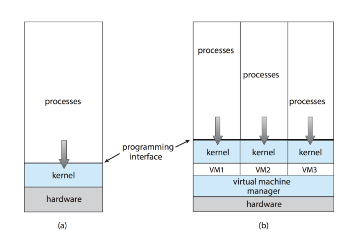
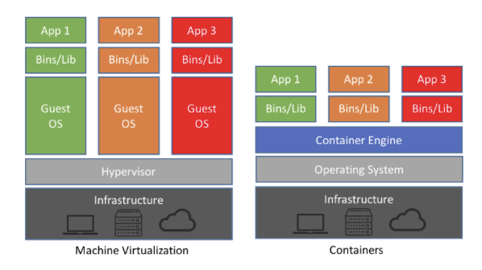

# ECE 350 - Virtualization and Containers

Not the same as emulation.

**Emulation**

* Literally, EMULATE the hardware instructions in software

**Virtualization**

* Different guest operating systems running on the same host
    * The guests run on the same architecture (e.g., x86, ARM, etc.)

 

## Perks of Virtualization

* Can run different operating systems on the same host
    * Or event different versions of operations systems

* Can suspend (pause) execution of VM by saving the system state

* Guests are completely isolated from each other, as well as the host
    * If one of the guests gets a virus, doesn't affect any other guest (theoretically)

## How it Works

Guests run on a ***virtual CPU*** (VCPU)

* Does not actually execute code
* It is just the CPU according to the guest machine

* Like a TCB kinda
    * The VCPU is a data structure that is used to manage the state of the guest CPU

The ***virtual machine manager*** (VMM) is responsible for maintaining state of VCPU.

* VMM is also called a ***hypervisor***

 

Recall, there are user mode and kernel mode instructions.

* Guests run in user mode, but needs to do some things in kernel mode (e.g., IO request, interrupts, etc.)

* ***Trap and Emulate***
    * If the guest attempts a privileged instruction, trap to VMM
    * VMM picks up the instruction and emulates the instruction

* ***Special Instructions***
    * Basically, edgecases where trap and emulate won't work
    * Need ***binary translation***
        * If guest is in user mode, can run instructions natively
        * If guest is in kernel mode, need to look at every instruction before its executed

# Virtualization Impacts on OS

## Scheduling

Need to schedule multiple guest's VCPUs on the host's singular CPU.

A guest is configured with some number of CPUs (cores)

* If there are no more cores left, need to timeslice between VCPUs
    * VMM can "steal" cycles from VCPUs which are currently idle
    * If it can't steal cycles, need to schedule which VCPUs can run

## Memory Management

### Nested Page Tables

Guest OS is unware that it is running in a VM - it thinks that it controls the page table.

* VMM has a nested page table
    * Re-translates guest's page table to the real (physical) page table
    * Double paging:
        * VMM has own page replacement strategy to help out the guests

### Device Driver

Insert a device driver into guest that allows VMM to excercise control over the guest.

A "***balloon***" memory manager is told to request a bunch of empty memory, then askss guest to pin the pages in physical memory.

Makes guest think that memory is in short supply, guest starts to free up memory.

VMM knows that balloon pages are not real, can allocate them to another guest.

### Duplicate Detection

VMM can see if the same page is loaded more than once.

* Likely to happen if there are two guests that are running the same OS

A hash value for a page is used.

* To see if pages are equal, compare the hash

## IO Devices

VMM can decide to allocate IO to guest.

* Simple case: just re-route requests to VM (e.g., USB drives)
* Otherwise, need to translate commands into actual device commands

## Disk

Typical approach is to create a *disk image*. This is just a big file on the host.

# Containers

Offers advantages of VMs, but not as much overhead.

* Guests share the same OS as the host
* No need to run multiple guest OSes concurrently
