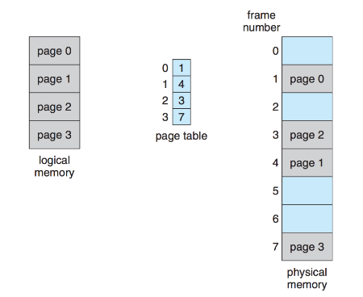
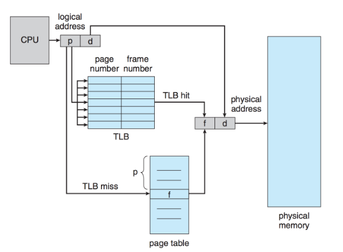
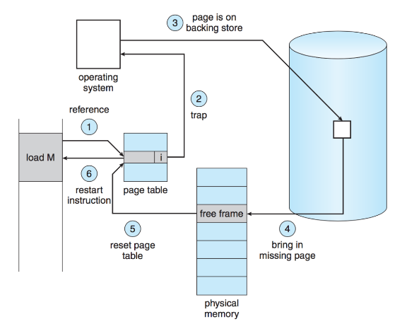

# ECE 350  - Memory

## Dynamic Memory Allocation

#### First Fit
Look at the start of memory and check each free block. If the block is big enough, split it (if needed) to allocate the memory.

Time complexity of O(n), where n is the number of blocks.

#### Next Fit
Modification of first-fit. Keep track of where the last block was allocated, start the next search (allocation) from there.

Prevents situation of a lot of small, un-allocated blocks all concentrated at the start of memory.

Time complexity is O(n).

#### Best Fit
Considering all blocks, choose the smallest block that is as least as big as N. Produces the smallest remaining unallocated space at the end of the block (less internal fragmentation)

Either check every available block (`O(n)`) or keep blocks sorted by increasing size (`O(n)`).

If AVL tree is used, can get it to `O( ln(n) )`

#### Worst Fit
Opposite of best fit. Instead of choosing the smallest block, choose the largest block. When the block is split, the remaining free block is hopefully large enough to be useful.

#### Quick Fit
More of an optimization than a complete algorithm.

If memory requests of a certain size are common (e.g., 1MB), keep a separate list of free blocks that are close to that size.

#### Binary Buddy
A compromise between fixed and variable allocation.

Memory blocks are available in powers of 2. Block is of size $2^K$ where $L \le K \le U$. $2^L$ is the min block size and $2^U$ is the max block size.

If an alloc request of size n occurs such that $2^{U-1} < n \le 2^U$, the entire block is allocated.

Otherwise, split into two "buddies" of size $2^{U-1}$. Keep splitting until you can't anymore (i.e, if you split again, the user won't get the memory they asked for).


## Caching

The effective access time for a system with 1 level of cache is the following.

$h \cdot t_c + (1 - h)t_m$

Where $h$ is the hit ratio, $t_c$ is time needed to load from cache, and $t_m$ is time needed to load from memory.

### Eviction Algorithms

#### The Optimal Algorithm
Replace the page that will be used most distantly in the future. Impossible to implement without clairvoyance.

Useful for benchmarking though.

#### Not Recently Used
Store 2 status bits associated with each page, `R` and `M`. `R` bit is set whenever a page is referenced, `M` bit is set when the page is written to (modified).

Periodically, `R` bit is cleared. When a TLB entry needs to be evicted, it will do it in the following order:

1. Not referenced, not modified
2. Not referenced, modified
3. Referenced, not modified
4. Referenced, modified

OS will prefer to remove a page from the lowest to highest.

#### First-In First-Out
Literally what the title is. Performance is bad.

#### A Second Chance (The Clock)
Improvement on FIFO. Give pages "a second chance" based on whether the `R` bit is set.

If the oldest page has recently been referenced, the R bit is cleared. The search then goes backwards to next oldest page. Repeat until you find a page that has the `R` bit clear, then evict it.

#### Least Recently Used (LRU)
The page that is going to be evicted is the one that has been accessed most distantly in the past.

Implement with a cyclic doubly linked linked list. When a page in cache is accessed, move that page to the back of the list. Gives O(1) time.

#### Not Frequently Used (NFU)
Similar to LFU, but can be implemented in SW without HW support.

Each page entry has an associated software counter, which starts at 0. Whenever the `R` bit would have been updated to 1, 1 is added to the counter. When a page is to be evicted, the page with the lowest counter value is the one that is replaced.

The counters need to decrement over time, otherwise they will increment forever until overflow.

We need **aging**: counters are shifted to the right by 1 before the 1 is added. Instead of adding 1, set the left most bit to 1. Get something like this:

```
0b10000000 --> 0b01000000 --> ... --> 0b00000001
```

Still evict the lowest value page. Lose some history, but whatever I guess.

### Choosing an Algorithm
LRU is best, but needs HW to make it not very slow. If no HW, NFU + Ageing is the best we can do.


### Local and Global Replacement
Should a TLB miss from process $P_1$ be able to evict a TLB entry that belongs to $P_2$?

If so, then that's **global replacement**.

If not, **local replacement**.

Local algorithms give each process some (roughly) fixed number of pages in the cache.

Global algorithms dynamically allocate cache space to different programs based on their needs - number of pages in TLB for each process can vary over time.


## Paging



The physical memory is divided into fixed chunks called **frames**.

A userspace process is given a **logical** address space, the logical address space is divided into **pages**. Pages are the same size as a frame.

A frame may be empty, or it can contain a page (i.e., the frame is being used by a process).


## TLB and Page Table

The page table is basically a lookup table with (potentially many) levels of cache.



1. The first level is the transition-lookaside-buffer (TLB), which is
   a fast HW cache
2. The second level is a page table in main memory

A process's logical memory address is split into a page number, and an offset.

Whenever a process attempts to access memory, the OS must index the page table with the logical address's page number, in order to get the physical frame number.

Looking up a frame in the page table looks like the following.

1. Try to get the frame number from the TLB
    * If TLB hit, then you have the frame number, easy
    * If TLB miss, go to 2.
2. Load frame number from LUT in main memory, replace some TLB entry with the entry just loaded from main memory (e.g., LRU)

The page table can also take in a process ID to see if a memory access is invalid or not.


## Virtual Memory

**Any** page can be swapped in and out of disk, even if the process which the page belongs to is currently running. (e.g., If a process doesn't need a particular page anymore it can be swapped out, but the process itself keeps running).

When a process tries to access memory in a page that is swapped out to disk, a page fault occurs.




Frames in main memory act as a cache for pages. If a page fault occurs, an "active" frame must be evicted (swapped out to disk) to make room for the page we are trying to access.

With virtual memory, a process's memory accesses look like this (note: the numbers do not correspond to the above image).

1. Check if memory reference is valid or invalid (is it trying to access a page that doesn't belong to it?)
    * If the access is invalid, throw a segmentation fault

<br>

2. Look in the TLB for the frame number
   * If found in TLB, we're good. Just access the memory with the frame number we found.

<br>

3. If TLB miss, try to get the frame number from the page table in main memory
   * If found in main memory, update the TLB using whatever eviction
     policy (e.g., LFU), then access the memory

<br>

4. If the frame number cannot be found in the page table (i.e., there are no frames that currently have the page we're looking for), that means that the page has been swapped out to disk. This is a page fault.

<br>

5. Choose a page to evict according to the eviction policy (e.g., LFU)
    * If the page to evict has been modified, queue a write back to disk
        * Wait for the write to complete if so

<br>

6. Read the frame we are trying to access from disk

<br>

7. Update page tables to reflect the newly read and swapped out frames

<br>

8. Restart the execution of the process that caused the page fault, at the instruction that caused the page fault
