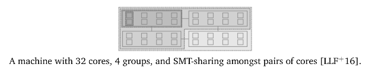

# ECE 350 - Scheduling in UNIX, Windows, and Linux

## Traditional UNIX

Traditional UNIX is actually pretty old. Replaced by SRV4 (which had some real-time support).

* Multilevel queue system, using Round Robin within each of the priority queues
* Timeslicing is implemented, default timeslice is 1 second
  * If a process does not block of complete within 1s, it will be preempted
* Priority is based on the process type and the execution history

There is a metric, processor utilization (not the same as CPU utilization, for UB tests). Processor utilization for process $j$ is calculated for an interval $i$ as such:


$$
CPU_j(i)= \frac{CPU_j(i-1)}{2}
$$


Priority for process $j$ at interval $i$ is calculated by:


$$
P_j(i) = B_j + \frac{CPU_j}{2} + N_j
$$


where $B_j$ is the base priority, and $N_j$ is the "nice" value.

The "nice" value is a UNIX way to allow a user to voluntarily reduce the priority of a process (to be "nice" to other users). In reality, no one really uses this other than sys admins, who can "re-nice" a process.

A process is assigned to a given category based on what kind of process it is (1 is highest priority):

1. Swapper (move processes to and from disk)
2. Block IO device control (e.g., disk)
3. File manipulation
4. Character IO device control (e.g., keyboard)
5. User processes

$CPU$ and $N$ components of priority equation are restricted to prevent a process from jumping between categories.

User processes get lowest priority, but the hierarchy provides responsive IO, and tends to penalize CPU-bound tasks at the expense of IO-bound tasks. CPU-bound tasks can execute while IO-bound tasks are waiting of interrupt.

Effective for a general-purpose, time-sharing OS.

### Upgrading to SRV4

A complete overhaul - priority assigned as such:

1. "Real-time" processes
2. Kernel processes
3. User-mode processes

Main differences:

1. More priority levels added - 160 broken down into 3 types
2. Preemption points
   * Needed since the original version didn't expect kernel processes to be preemptable
   * Preemption points are placed in the code where it is okay for the kernel to be preempted
     * In practice, this means locks to prevent race conditions

### FreeBSD

BSD: Berkeley Software Distribution - another form of UNIX. FreeBSD is a descent of BSD.

Similar to SRV4, but with more priority levels. Also has *interactivity scoring*.

* Interactivity score identifies which threads are user-interactive and which ones are CPU-intensive
* User-interactive threads get higher priority

Interactivity is judged based on how much the thread gets blocked.

* If it's waiting for network or user, it would be considered interactive

Interactivity score is calculated as such:


$$
\begin{cases}
	\frac{m}{2}\frac{r}{s} & s > r \\
	\frac{m}{2}(1 - \frac{r}{s}) & r > s 
\end{cases}
$$


where $m$ is the maximum interactivity score, $r$ is the runtime, and $s$ is the sleeptime.

Ensures that threads that sleep more than run are higher priority.j

Also implements load-balancing for multi-core. Uses both push and pull mechanisms to move threads across cores.

## Windows

Priority-based, preemptive scheduling algorithm.

* Highest priority thread runs.
* Official name for the selection routing is the **dispatcher**
* A thread will run until its preempted, blocks, terminates, or until timeslice expires.

32 different priority levels. 6 priority "classes" (higher numbers are higher priorities).

1. Realtime
2. High
3. Above Normal
4. Normal
5. Below Normal
6. Low

Dispatcher maintains a queue for each of the scheduling priorities - goes through them from highest to lowest When the dispatcher has nothing else to do, it will run the System Idle Process.

If a process reaches the end of a time slice, the thread is interrupted. Unless it is in the real-time category, its priority will be lowered to a min of the base priority of each class.

If a process is blocked on something (e.g., IO), its priority is temporarily boosted. Amount of boost depends on what it is waiting on (e.g., keyboard, disk, etc.).

Includes mechanism to make sure tasks don't starve. Processes with a low priority can get a temporary boost to make sure they get a chance to run.

**Also gives priority boost to whichever process is running in the selected foreground window.**

## Linux

2 scheduling modes: real-time and non-real-time.

* Not mutually exclusive
  * Can have non-real-time threads even if using the real-time scheduler
    * Real-time threads will get priority, and non-real-time threads will be scheduled according to the non-real-time scheduler

### Linux Real-Time Scheduler

Operates on *scheduling classes*:

1. `SCHED_FIFO`
   * FIFO real-time threads
2. `SCHED_RR`
   * Round-robin real-time threads
3. `SCHED_OTHER`
   * Other (non-real-time) threads

In each class, threads have different priorities relative to each other. Lower numbers are higher priorities.

* Real-time priorities are (0-99)
* Other priorities are (100-139)

#### FIFO Scheduling Policy

1. Wil only preempt another FIFO thread if one of the following is true:

   1. Another FIFO thread of higher priority becomes ready

   2. Current FIFO thread gets blocked (e.g., on IO)

   3. Current FIFO yields

2. If a FIFO thread in preempted, it is placed in the queue associated with its priority

3. If a FIFO thread becomes ready and is of higher priority of the currently running thread, the currently running thread is preempted

#### Round-Robin Scheduling Policy

Same as FIFO, but timeslicing is implemented.

### Linux O(1) Scheduler (Non-Realtime)

Designed to fix shortcomings of traditional UNIX scheduler, which were:

1. Not good at handling large numbers of processes
   * O(n) algorithm
2. Difficulty with multi-processor systems
   * Single run queue
     * No processor affinity
   * Single run queue lock
     * All processors need to wait for lock, O(n)
   * Cannot preempt running processes
     * Need to wait for timeslice

Kernel maintains two data structures:

```C
struct prio_array
{
    int32_t          nr_active;                 // Number of tasks in this array
    uint64_t         bitmap[BITMAP_SIZE];       // Priority bitmap
    struct list_head queue[MAX_PRIO];           // Priority queues
}
```

Two queues per priority level - active queue structure, as well as an expired queue structure. Bitmap array is of size to provide one bit per priority level - purpose of bitmap is to indicate which queues are empty.

The highest priority queue is chosen. If there are multiple tasks in the queue, they are scheduled via Round-Robin.

If a task runs to completion within its timeslice, it goes back to the ready queue. If it gets preempted by the timeslice, it goes into the expired queue. When the active queue is empty, it is swapped with the expired queue, then execution continues.

O(1) (technically), because of the following:

1. Add task to the queue, O(1)
2. Find next task
   * Need to look a linear search of the bitmap
   * Bitmap has a constant length though, so it's **technically** O(1)
3. Remove task from queue O(1)
4. Swap active and expired queues O(1)

### Linux Completely Fair Scheduler (CFS)

Not O(1) unfortunately.

* Ready queue implemented as red-black tree, processes are inserted based on linear ordering of **`vruntime`**
  * Tree remains balanced, so insert/removal time is $O( ln(n) )$. We pick the task with the smallest `vruntime` to run next

* Assigns a proportion of CPU time to each task based on the nice value. No fixed timeslice, but a dynamic timeslice called **target latency**
  * Target latency can be adjusted depending on how many tasks in the ready queue, etc.

* `vruntime` is a metric that accounts for the amount of time a task has been executing and the niceness value of a task
  * There is a decay factor so that tasks don't get starved
  * Higher priority processes decay faster than low priority processes (remember, we pick the **lowest** `vruntime` from the queue)
  * "Nice" processes will have an artificially higher `vruntime`, and "not nice" processes will have a lower `vruntime`

Under this system, tasks that use a lot of CPU time get lower priority, while tasks that get blocked a lot (e.g., IO) get higher priority.

CFS also introduces group scheduling - designate a set of processes as belonging to a group

* Useful when a process spawns lots of threads
* Instead of treating every thread equally, a multi-threaded application's threads are pooled together

## A Decade of Wasted Cores

A research paper published in 2016, exposed four significant bugs in the Linux multi-core schedule.



1. **The Group Imbalance Bug**
   * Cores attempt to steal tasks from other cores if the *average* load of the victim core is higher than the current core
   * If we use the minimum load instead, we get a big increase in performance
2. **Scheduling Group Construction**
   * If groups are two hops (cores) apart, the load balancing may not steal them
   * All groups are constructed from the perspective of core 0
     * Load balancing running on core 31 won't steal from a neighbour core since it is more than 2 hops from core 0
3. **Overload on Wakeup**
   * "Too much" processor affinity
     * If a thread sleeps on core 1, then it gets unblocked later by another thread, it will be scheduled on core 1, even if other cores are idle
4. **Missing Scheduling Domains**
   * Error during refactoring
   * When a core was removed and re-added, a step was skipped after refactoring changes
     * Caused all threads of an application to run on a single core instead of all of them
