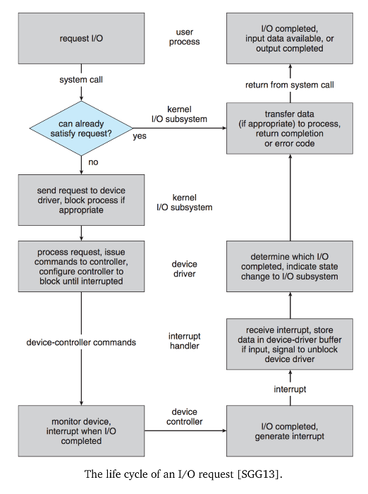

# ECE 350 - IO Devices and Drivers

IO is a lot slower than the CPU. Thus, how we handle IO is very important.

## Communication with Devices

Three main ways for SW to interact with HW:

1. Polling
2. Interrupts
3. DMA

## Application IO Interface

Device-to-device communication protocols vary a lot. Different IO devices also vary a lot. Thus, there is a need for a uniform interface for the OS to communicate with hardware - drivers.

This is especially true when writing a general-purpose OS like Windows or Linux, which is expected to work on a lots of different HW.

In order to create a uniform interface, can categorize HW devices into distinct groups that share important qualities:

* **Data Transfer Mode**
  * e.g., one byte at a time vs a block of bytes
* **Access Method**
  * e.g., sequential access vs random access
* **Transfer Schedule**
  * e.g., synchronous vs asynchronous
* **Dedication**
  * e.g., multiple threads allowed to access device, vs only one thread
* **Device Speed**
  * Obvious
* **Transfer Direction**
  * e.g., bi-directional vs uni-directional

<br>

Operating systems also implement an *escape* syscall to allow sending arbitrary commands to a device. In Linux, this is the `ioctl` syscall.

* Allows us to issue commands that OS designers didn't think of (and didn't create syscalls for)

### Character Devices

Something like a keyboard, works on a byte-by-byte basis.

Syscalls are `get()` and `put()`.

### Block Devices

Something like a hard disk drive - operates on blocks of data.

Syscalls are `read()`, `write()`, and `seek()`.

### Network Devices

Functionally different than all other devices (especially if wireless). There is a bunch of latency, potential for packet loss, etc.

Implemented via the socket API. A socket is treated like a file.

## Spooling and Reservations

A **spool** is a buffer for a device that can serve only 1 job at a time. (e.g., printer)

Printer needs to finish a whole print job before it starts the next. OS centralizes all communication to the printer through the spool.

## IO Protection

Recall that there are kernel mode and user mode instructions - some instruction are restricted so that only the OS can issue them (in kernel mode), otherwise it is an illegal instruction.

Want all user accesses to HW to be mediated through the OS - prevent invalid requests to HW. Tradeoff though, more security for less performance.

In certain scenarios, we want user programs to have direct access to HW (for performance reasons). An example would be allowing a video game direct access to the GPU

## Kernel HW Data Structures

Kernel must keep track of what HW devices are in use by which process, and the general state of the HW device.

Keeps the devices as an index to the **system-wide open-file table**.

Explains why if you print a file descriptor, you just see a number - it's the index to the open-file table.


## Syscalls to HW Operations



1. A process issues a `read()` (assuming the file is already open).
2. Syscall checks parameters for correctness. If data is in cache or buffer, return it right away.
3. Block process waiting for IO
4. Device driver allocates buffer for data
5. Device driver may either poll for status, wait for interrupt, or for DMA interrupt
6. On interrupt, copy data to driver's buffer
7. Copy data to address space of requesting process, unblock the process

## Buffering

Area of memory that stores data being transferred. Good way to deal with speed mismatch between devices.

Buffers can be implemented as a solution to the producer-consumer problem:

```C
void producer(void)
{
    // [produce item]
    wait( spaces );

    wait( mutex );
    // [add item to buffer]
    post( mutex );

    post( items );
}

void consumer(void)
{
    wait( items );

    wait( mutex );
    // [remove item from buffer]
    post( mutex );

    post( spaces );

    // [consume item]
}
```

### Double Buffering

While one buffer is being emptied, the other one is being written to. Decouples the producer and consumer.

Common use is to have a DMA copy data to one buffer, while consumer reads data from the other. On DMA interrupt, switch DMA to write to the other buffer, then process the data on the one that the DMA has just written to.

## IO Scheduling and Performance

Analogy:

* Imagine you need to go to the E7, SLC, and the plaza
  * You wouldn't do E7, to SLC, then plaza
    * Very inefficient route
  * You want to plan your route to minimize distance traveled
  * Want to avoid backtracking

Same for IO, many IO devices have non-uniform access time (e.g., disk). Tradeoff between speed and fairness of requests.

## Security

Most operating systems let drivers run in the kernel. There is an attack known as "Bring Your Own Vulnerable Driver" (BYOVD).

* Convince an admin to intentionally install your vulnerable driver (they don't know that its vulnerable)
* Exploit your bad driver

Need to be able to "revoke" previously-approved drivers.

Some operating systems provide user-space interfaces to do drivers, which also helps.