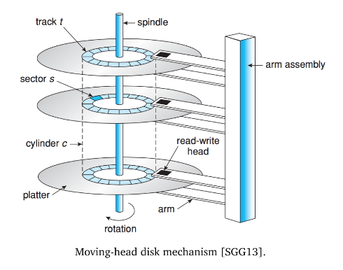
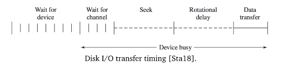
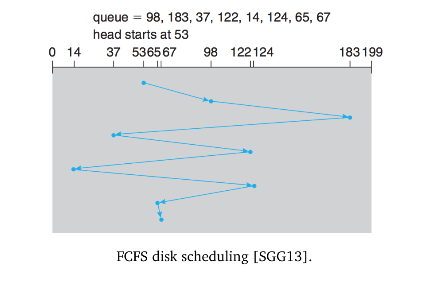
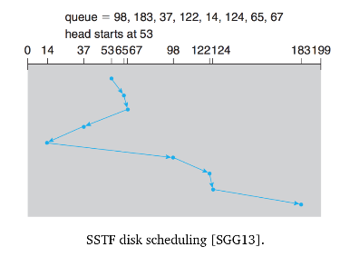
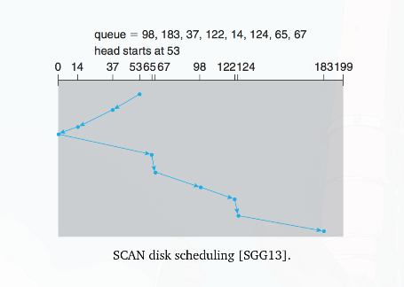
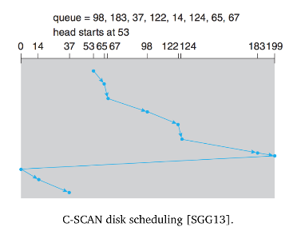
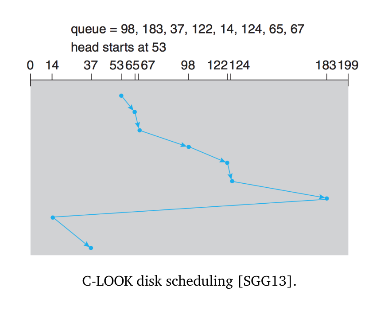

# ECE 350 - Disk Scheduling

Disk is very slow, how we schedule disk operations is very important.

## Hard Disk Internals

Reading or writing to the disk looks like so:

Total average access time $T_a$ for a disk operation is
$$
T_a = T_s + \frac{1}{2r} + \frac{b}{rN}
$$
where $T_s$ is the **seek time**, $r$ is the **rotation speed** (revs per sec), $b$ is the number of bytes to be transferred, and $N$ is the number of bytes on a track.

**Bandwidth** of disk:

* Total number of bytes transferred, divided by the total time between request for service and completion of the transfer

## Disk Scheduling

Want to improve bandwidth and access time.

When a process needs to read or write from disk, syscall contains the following information.

1. If the operation is a read or write
2. Disk address of the transfer
3. Memory address of the transfer
4. How much data to transfer (how many sectors)

### First-Come First-Served

Obviously un-optimal. Fair, but slow.

### Shortest Seek Time First (SSTF)

Want adjacent operations to take place consecutively. Instead of just choosing next item in queue, choose request with lease seek time from the current head position.

Requests that are far away from current head position can get starved though.

Although its an improvement, it is not (provably) *optimal*.

Provides for some spatial locality, will service writes that are close to each other.

### SCAN Scheduling

Elevator algorithm. "Scans" whole disk in one direction, then other direction, over and over again.

Doesn't take advantage of spatial locality. If the head has just moved from an area, it can be a long time before it returns to that area.

### C-SCAN Scheduling

An improvement on SCAN.

When the disk has just reached one end, most requests are likely at the other end of the disk. Instead of reversing the direction, jump back to start of disk immediately and start at beginning.

### LOOK and C-LOOK Scheduling

Optimization of SCAN and C-SCAN respectively.

Don't go all the way to the start/end of disk every time. Instead, reverse direction at the final request.

## Evaluation of Algorithms

FCFS sucks.

LOOK approach seems it would prevent the starvation problem which might be present in SSTF. SCAN and C-SCAN prevent starvation technically, but some requests will have to wait a long time.

A strategy to prevent this is a modification of SCAN. Use 2 queues. While 1 queue is emptied, the other is filled (like a double buffer strategy). Requests won't wait indefinitely, they just have to wait until the other queue is emptied. The choice of queue size is a trade off, sacrifice performance for fairness.

 

The above algorithms only consider seek times, not rotational latency (even though they can be similar). Very difficult for the OS to schedule for rotational latency.

* The disk itself is responsible for physical placement of the logical blocks.
  * Hard disk controller can take on some of the scheduling
* OS can provide the disk controller a grouping of requests, then the controller figures out how to best schedule them in a way that accounts for rotational latency