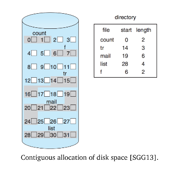
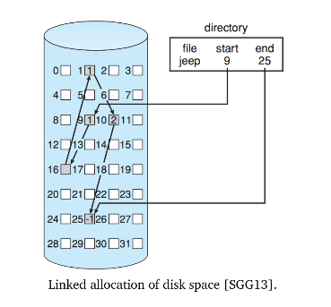
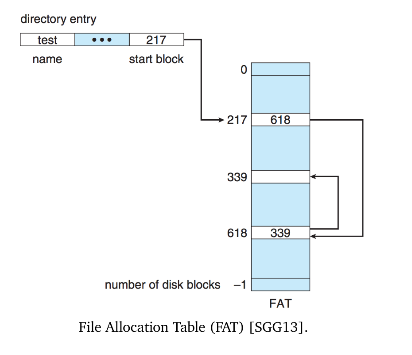
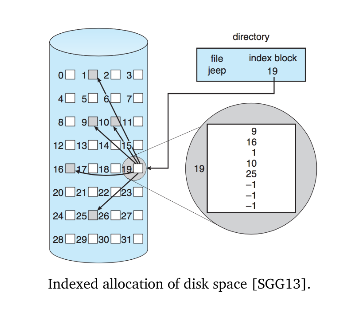
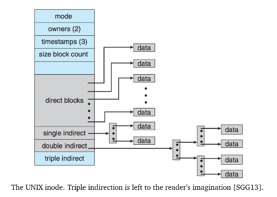
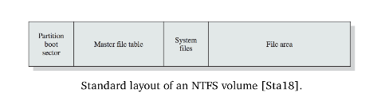

# ECE 350 - Filesystems

Layers of a filesystem:

1. **The File System**
   * File system user interface, intended for the convenience of the user.
2. **IO Control**
   * Device drivers and interrupt handlers to transfer data
   * High-level commands, such as "read block 1234"
   * Output is hardware instructions to the hardware controller - writing bits to the bus
3. **Basic File System**
   * Physical blocks on the disk
   * Physical block is identified by its numerical physical address
     * drive 0, cylinder 12, track 7, sector 1
   * This layer is also responsible for buffers and caches used to hold commonly-accessed regions (e.g., `/tmp`)
4. **File Organization Module**
   * Translates logical block address to physical block address
   * Keeps track of free space
5. **The Logical File System**
   * Manges metadata
     * File system structure
     * Directory structure
     * Maintaining file structure
   * File data is maintained in a **file control block** (FCB)
     * UNIX term for this is `inode`
     * Place where file info is stored (e.g., ownership, permissions, locations of file contents)

## Disk Organization

At least one disk somewhere in the system needs to have bootloader (typically the first block).

Disks are plit into *partitions*. Accordingly, there is a partition table that indicates which part of the disk belongs to which partition.

There are several structures that are stored in memory (RAM) for performance reasons:

1. **Mount Table**
   * Information about each mounted volume
2. **Cache**
   * Directory info for recently accessed directories
3. **Global Open File Table**
   * Copy of the FCB for each open file
4. **Process Open File Table**
   * References to the global open file table, per process
5. **Buffers**
   * Places where data read from or written to resides before the actual disk operation

Creating a new file is the job of the logical file system - allocation of new FCB (or re-use of existing free FCB). An FCB looks like this:

When a user wants to make use of a file, it needs to be *opened*, `open` operates on the file names (string).

* Check the global open file table to see if its already open somewhere else
  * If it is open for non-exclusive access, just make another reference in the process open file table
  * If it is open for exclusive access, return throw an error

* If file not already open, it needs to be retrieved (from disk), then the FCB is copied into the global open file table, and a reference is added to the process table

The `open` syscall returns an index to the file table - in UNIX this is called a **file descriptor**.

When a process *closes* a file, the entry in the process open file table is removed. If there are no more references in the process table, the FCB is also removed from the global open file table. Metadata is updated on close.

## Virtual File System

There may exist multiple different filesystems on a system (e.g., ext3 on one partition, fat32 on another). They can co-exist thanks to the VFS.

* The VFS separates the filesystem operations (e.g., read, write, open, close) from the actual implementation
  * Thus, operations can be done with whatever filesystem is actually implemented.

* It also provides a **unique** representation of each file throughout the system
  * e.g., network drive vs local drive

VFS in Linux has four main objects:

1. **`inode`** (an individual file)
2. **`file`** (an open file)
3. **`superblock`** (the file system)
4. **`dentry`** (a directory entry)

## Directory Implementation

A B-Tree is the best way to implement the directory structure.

Use Google or chatgpt for understanding B-Trees, too lazy to write it down here.

## File Allocation Methods

Similar to dynamic memory allocation, need a strategy for how to allocate disk space for files.

Three major ways:

1. **Contiguous**
2. **Linked**
3. **Indexed**

### Contiguous Allocation

File occupies a set of contiguous blocks on disk. A file at block $b$ that is $n$ blocks in size would take up blocks $b, b+1, ..., b+(n-1)$.

* Advantageous, since seek time for contiguous blocks on disk is very small.

We just need to maintain $b$ and $n$.

Like dynamic allocation, this approach suffers from **external fragmentation**. Since blocks are fixed size, there is a bit of **internal fragmentation** as well in the las block of the file.

* To fix the external fragmentation, **compaction** can be scheduled
  * When to schedule it? There are no really great times...

Also a risk of allocating too little space.

* We may be able to just allocate more at the end, maybe not (if the next block is used by another file)
  * In that case, need to reallocate the whole file

### Linked Allocation

Solves some of the problems with contiguous allocation.

For each file, maintain a linked-list of blocks, and the blocks can be located anywhere on the disk.

* Directory listing is just a pointer to the first and last blocks (head and tail)

* If a new file is created, it will be created with size zero, and the head and tail pointers are null
  * When a new block is needed, it can come from anywhere, and will just be added to the list

Compaction isn't an issue anymore, but need to follow a bunch of pointers to read the whole file (annoying).

A possible solution to following so many pointers (and the overhead of maintaining so many) is to group the blocks into clusters.

* A cluster is composed of blocks (say, 4 maybe...)
* The linked list is now a list of clusters, as opposed to a list of blocks

This solution also improves disk access time, since the reader head has to move around less.

#### FAT

One variation of linked allocation is the **File Allocation Table** (FAT), used by MS-DOS. FAT32 is still used today for USB flash drives, since it is readable in Windows, OSX, and Linux.

FAT works like this:

* At the beginning of the disk, there is a table to maintain file allocation data (hence the name)
  * The table has one entry for each block, and is indexed by block number
* The block has a pointer to the next block

* An unused block has a table value of 0
  * To allocate a new block, find the first zero-valued entry

The File Allocation Table itself should be cached in RAM.

### Indexed Allocation

With linked allocation, there is still a problem where in order to access the some part in the middle of a file, we need to traverse the whole linked-list $( \; O(n) \; )$.

Indexed allocation takes all of the pointers and puts them into one block - an **index block**.

* So, the first block of the block contains a whole bunch of pointers
* To get to block $i$, just go to index $i$ of the index block to get the location of block $i$

But then, what if we run out of space in the index block? A few solutions:

1. **Linked Scheme**
   * Use a linked-list of index blocks

2. **Multilevel Index**
   * Just use multiple index blocks
   * This approach can still run out of indexes though
     * Requires defining a maximum file size

3. **Combined Scheme**
   * "All of the above"
   * Used in UNIX, 15 pointers in the index block of an inode
     * 12 of them point to file data
     * Next three pointers refer to index blocks

## Free Space

System needs to keep track of the free space as well.

* **Bit Vectors**
  * $O(n)$ search basically
* **Linked List**
  * Linked list of free space

## Filesystem Corruption

Power loss can cause filesystem corruption.

Can check for corruption (inconsistent data) periodically (e.g., on boot). Many operating systems do this.

### Journaling

Instead of periodically checking for corruption, could just prevent it all together.

We need a concept of the **transaction**.

* All metadata changes are written sequentially to a log file
  * Once changes are written to log, control may return to program that requested the filesystem operation
* When an entire transaction is completed, it is removed from the log file

If the system crashes, if the log file contains uncompleted transactions, then we can undo the in-progress operations and go back to the filesystem state before the transaction.

## NTFS (Windows File System)

NTFS uses journaling, and supports large disks and large files.

Uses different storage levels:

1. **Sector**
   * Smallest physical storage unit on disk (512 bytes usually)
2. **Cluster**
   * One or more contiguous sectors (grouped in a power of 2)
   * The fundamental unit of allocation in NTFS
3. **Volume**
   * A logical partition on disk, consisting of one or more clusters

The *Master File Table* (MFT) contains information about all the files and folders. Following the MFT, a block is allocated to system files that include important system info:

1. **MFT2**
   * Copy of the first few rows of the MFT (in case the original one gets corrupted)
2. **Log File**
   * Journal transaction log
3. **Cluster Bitmap**
   * Bitmap showing which of the clusters are in use
4. **Attribute Definition Table**
   * Attribute types supported on this volume
