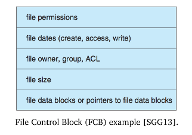
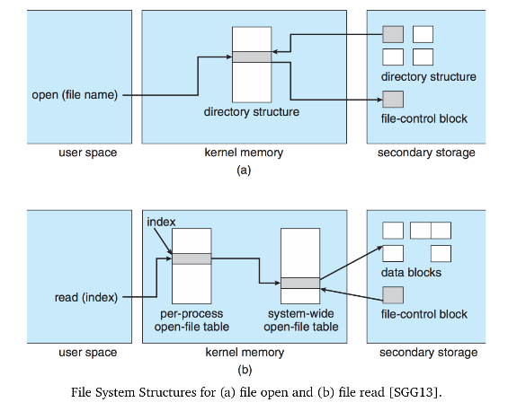
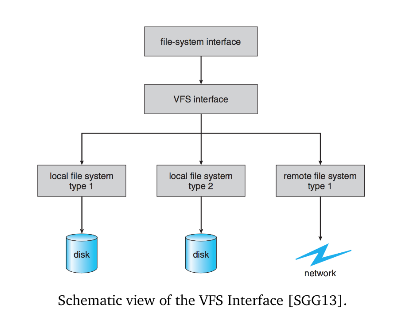
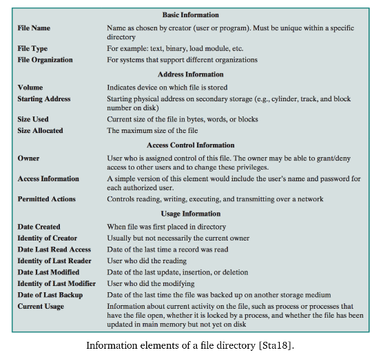

# ECE 350 - Filesystems

Layers of a filesystem:

1. **The File System**
   * File system user interface, intended for the convenience of the user.
2. **IO Control**
   * Device drivers and interrupt handlers to transfer data
   * High-level commands, such as "read block 1234"
   * Output is hardware instructions to the hardware controller - writing bits to the bus
3. **Basic File System**
   * Physical blocks on the disk
   * Physical block is identified by its numerical physical address
     * drive 0, cylinder 12, track 7, sector 1
   * This layer is also responsible for buffers and caches used to hold commonly-accessed regions (e.g., `/tmp`)
4. **File Organization Module**
   * Translates logical block address to physical block address
   * Keeps track of free space
5. **The Logical File System**
   * Manges metadata
     * File system structure
     * Directory structure
     * Maintaining file structure
   * File data is maintained in a **file control block** (FCB)
     * UNIX term for this is `inode`
     * Place where file info is stored (e.g., ownership, permissions, locations of file contents)

## Disk Organization

At least one disk somewhere in the system needs to have bootloader (typically the first block).

Disks are plit into *partitions*. Accordingly, there is a partition table that indicates which part of the disk belongs to which partition.

There are several structures that are stored in memory (RAM) for performance reasons:

1. **Mount Table**
   * Information about each mounted volume
2. **Cache**
   * Directory info for recently accessed directories
3. **Global Open File Table**
   * Copy of the FCB for each open file
4. **Process Open File Table**
   * References to the global open file table, per process
5. **Buffers**
   * Places where data read from or written to resides before the actual disk operation

Creating a new file is the job of the logical file system - allocation of new FCB (or re-use of existing free FCB). An FCB looks like this:

When a user wants to make use of a file, it needs to be *opened*, `open` operates on the file names (string).

* Check the global open file table to see if its already open somewhere else
  * If it is open for non-exclusive access, just make another reference in the process open file table
  * If it is open for exclusive access, return throw an error

* If file not already open, it needs to be retrieved (from disk), then the FCB is copied into the global open file table, and a reference is added to the process table

The `open` syscall returns an index to the file table - in UNIX this is called a **file descriptor**.

When a process *closes* a file, the entry in the process open file table is removed. If there are no more references in the process table, the FCB is also removed from the global open file table. Metadata is updated on close.

## Virtual File System

There may exist multiple different filesystems on a system (e.g., ext3 on one partition, fat32 on another). They can co-exist thanks to the VFS.

* The VFS separates the filesystem operations (e.g., read, write, open, close) from the actual implementation
  * Thus, operations can be done with whatever filesystem is actually implemented.

* It also provides a **unique** representation of each file throughout the system
  * e.g., network drive vs local drive

VFS in Linux has four main objects:

1. **`inode`** (an individual file)
2. **`file`** (an open file)
3. **`superblock`** (the file system)
4. **`dentry`** (a directory entry)

## Directory Implementation

A B-Tree is the best way to implement the directory structure.

Use Google or chatgpt for understanding B-Trees, too lazy to write it down here.