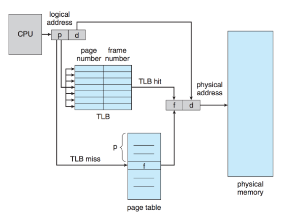
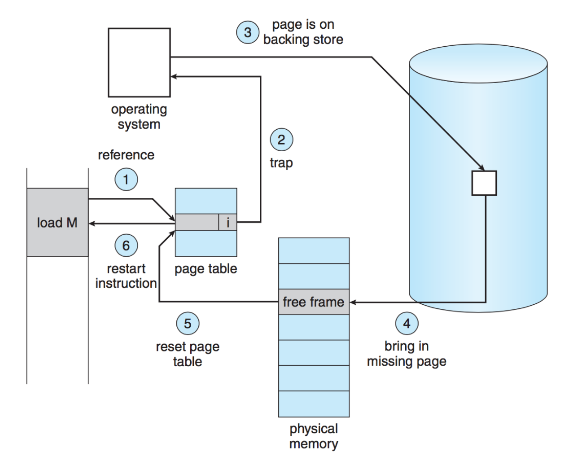

# ECE 350 Memory Notes

## Dynamic Memory Allocation

#### First Fit
Look at the start of memory and check each free block. If the block
is big enough, split it (if needed) to allocate the memory.

Time complexity of O(n), where n is the number of blocks.

#### Next Fit
Modification of first-fit. Keep track of where the last block was
allocated, start the next search (allocation) from there.

Prevents situation of a lot of small, unallocated blocks all
concentrated at the start of memory.

Time complexity is O(n).

#### Best Fit
Considering all blocks, choose the smallest block that is as least
as big as N. Produces the smallest remaining unallocated space
at the end of the block (less internal fragmentation)

Either check every available block (`O(n)`) or keep blocks
sorted by increasing size (`O(n)`).

If AVL tree is used, can get it to `O( ln(n) )`

#### Worst Fit
Opposite of best fit. Instead of choosing the smallest block,
choose the largest block. When the block is split, the remaining
free block is hopefully large enough to be useful.

#### Quick Fit
More of an optimization than a complete algorithm.

If memory requests of a certain size are common (e.g., 1MB), keep a separate
list of free blocks that are close to that size.

#### Binary Buddy
A compromise between fixed and variable allocation.

Memory blocks are available in powers of 2. Block is of size
$2^K$ where $L \le K \le U$. $2^L$ is the min block size and $2^U$ is
the max block size.

If an alloc request of size n occurs such that $2^{U-1} < n \le 2^U$,
the entire block is allocated.

Otherwise, split into two "buddies" of size $2^{U-1}$. Keep splitting until
you can't anymore (i.e, if you split again, the user won't get the
memory they asked for).

## Paging

The physical memory is divided into fixed chunks called **frames**.

A userspace process is given a **logical** address space, the logical
address space is divided into **pages**. Pages are the same size as
a frame.

A frame may be empty, or it can contain a page (i.e., the frame is
being used by a process).

## TLB and Page Table

The page table is basically a lookup table with (potentially many)
levels of cache.

1. The first level is the transition-lookaside-buffer (TLB), which is
   a fast HW cache
2. The second level is a page table in main memory

A process's logical memory address is split into a page number, and
an offset.

Whenever a process attempts to access memory, the OS must index the
page table with the logical address's page number, in order to get the
physical frame number.

Looking up a frame in the page table looks like the following.

1. Try to get the frame number from the TLB
    * If TLB hit, then you have the frame number, easy
    * If TLB miss, go to 2.
2. Load frame number from LUT in main memory, replace some TLB entry
   with the entry just loaded from main memory (e.g., LRU)

## Virtual Memory

**Any** page can be swapped in and out of disk, even if the process which
the page belongs to is currently running. (e.g., If a process doesn't
need a particular page anymore it can be swapped out, 
but the process itself keeps running).

When a process tries to access memory in a page that is swapped out
to disk, a page fault occurs.

Frames in main memory act as a cache for pages. If a page fault occurs,
an "active" frame must be evicted (swapped out to disk) to make room for
the page we are trying to access.

With virtual memory, a process's memory accesses look like this (note:
the numbers do not correspond to the above image).

1. Check if memory reference is valid or invalid (is it trying to access
   a page that doesn't belong to it?)
    * If the access is invalid, throw a segmentation fault

 

2. Look in the TLB for the frame number

 

3. If TLB miss, load the frame number from main memory, update TLB using
   whatever eviction policy (e.g., LFU)

 

4. Attempt to access the frame which was read from the page table in steps 3/4.

 

5. Get a page fault (OS trap) if the frame we are trying to access
   is swapped out to disk

 

6. Choose a page to evict according to the eviction policy (e.g., LFU)
    * If the page to evict has been modified, queue a write
      back to disk
        * Wait for the write to complete if so

 

7. Read the frame we are trying to access from disk

 

8. Update page tables to reflect the newly read and swapped out frames

 

9. Restart the execution of the process that caused the page fault,
   at the instruction that caused the page fault
