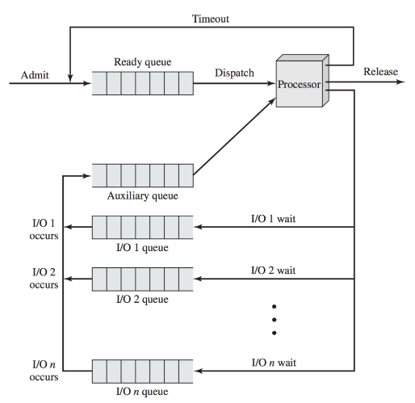
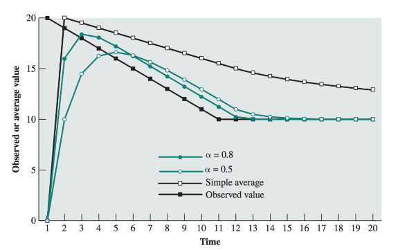
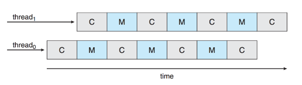

# ECE 350 Scheduling Notes

## Scheduling Algorithms

#### Highest Priority, Period
Highest priority task runs always, no matter what. Higher priority tasks must yield to
lower priority tasks for them to be able to run.

Good for hard real-time, safety critical systems. Otherwise, can starve lower-priority tasks.
Lower priority tasks may never get the chance to run.

#### First-Come, First-Serve (FCFS)
Whichever process requests the CPU first gets it. A queue of jobs where all jobs are equal.

Ignores priority entirely.

Generally non-preemptive. A process at the front of the queue will run until completion.
One process could monopolize the CPU.

Tends to favour CPU-bound tasks rather than IO-bound tasks. When a CPU-bound task
is running, the IO bound task must wait in the queue like everyone else.

Inefficient use of resources. For example, the disk is slow, so we would like to
keep it busy at all times. With FCFS, IO devices are likely to suffer idle periods.

#### Round Robin
Introduce time slicing. Every $t$ units of time, a timer generates an interrupt that
runs the short-term scheduler.

Combining FCFS with time slicing gives us Round Robin.

Choosing time slice $t$ is important. If $t$ is too short, OS spends too much CPU utilization
running the scheduling algorithm. If $t$ is too long, tasks have to wait too long for their turn.

##### Virtual Round Robin
Round Robin, but IO-bound processes get priority. Have a separate auxiliary queue
for tasks waiting for IO that gets priority.

#### Shortest Process Next
IF some information about the execution time of tasks are available, we may wish
to give priority to shorter processes.

Faster turnaround and better responsiveness.

Longer processes may need to way an unpredictable amount of time.

May work, but need info on execution time of jobs, which is hard to get.

#### Shortest Job First
Name is misleading. Should be called "shortest next CPU burst".

Goal is to choose the process that is likely to have the smallest CPU burst.

Algorithm is provably optimal in giving the minimum average waiting time for processes.

Problem is predicting CPU burst times. Gather information about jobs that have run
before, average them out.

Best averaging method is exponential averaging. Apply weighting factor $0 \le \alpha \le 1$.

$S_{n+1} = \alpha T_n + (1 - \alpha)S_n$

#### Shortest Remaining Time
Literally what the name is.

Chance that long processes will starve because of a steady stream of shorter processes.

No longer need to have time slicing. Instead of periodic timer interrupts, can run the
scheduler on other interrupts (e.g., users launching programs, hardware operations
completed, etc.).

#### Highest Response Ratio Next
Calculate response ratio $R = \frac{w + s}{s}$, where $w$ is the waiting time and $s$
is the service time.

Service time is a guess. When it is time to select the next process to run,
choose process with highest $R$.

Introduces important thing: age of the process.

The term $w$ indicates how much time a process has spent waiting. A process that has
spent a long time waiting will rise in priority.

#### Multilevel Queue (Feedback)
Desktop or laptop has many jobs running. Some are visible to user (foreground) and
some are not (background).

Take the ready queue and break it into several queues, each with a priority. Split based
on process attributes (e.g., priority, memory needs, foreground or background, etc.).

A process can move up and down the priority list.

Also referred to as *feedback*, assign priority based on the amount of CPU time assigned
so far. A process that has used a lot of CPU already gets lower priority.

#### Guaranteed Scheduling.
Promise the users something and fulfill that promise.

For example, if there are $n$ users, each get an equal share $\frac{1}{n}$ of CPU time.

#### Lottery
Each process is given some number of "lottery tickets". When a decision needs to
be made, a lottery ticket is selected at random. The process that has that ticket
gets to run.

If the RNG is sufficiently random, over time the CPU utilization approaches the 
proportions of tickets each process holds.

For example, if $P_A$ has 20% of tickets, $P_B$ 30%, and $P_C$ 50%, the CPU utilization
of each process will tend towards 20:30:50.

## The Idle Task
What to do when there is literally nothing to do? OS implements an idle task to
do in this scenario.

Could just spin in a `NOP` loop, could gather accounting info, could put CPU into
low power state, etc.

## Priority Inversion and Inheritance

Consider 3 jobs.

| Job Name | Priority |
| -------- | -------- |
| H        | High     |
| M        | Medium   |
| L        | Low      |

Suppose $H$ and $L$ both access a shared resource protected by a mutex.

If $L$ acquires the resource, it will block execution of $H$ until it releases it.

While $L$ has the resource, $M$ could preempt $L$. In this case, $M$ will be indirectly
blocking execution of $H$.

This is **priority inversion** bug.

To solve, could just prevent context switching while $L$ has the mutex (disable interrupts).

A better solution is priority inheritance. $L$, while it has the mutex, will execute with
$H$'s priority, so $M$ cannot preempt it.

## Multiprocessor Scheduling

### Processor Affinity
Each core has its own cache. After some time after executing on
a core, most of its state will be in that core's cache.

When this process runs again, it would make sense that it should run again
on that core.

This is **processor affinity**.

There is *soft affinity*, where the scheduler will make a best effort
to give its preferred core.

There is *hard affinity*, where the scheduler **must** give the process
its preferred core.

### Load Balancing
If we have 4 processes, it would be bad to have 100% utilization on 1 core and
3 cores doing nothing.

Want to **load balance** between the different cores.

There is **push migration**, where a task periodically checks how busy each core is.
Moves processes around to balance things out.

There is **pull migration**, where a core with nothing to do "steals" a process
from the queue of a busy core.

### Hyperthreading
Two "threads" running on 1 core, making 1 core look like 2 cores.

While one thread is stalling on a memory operation, the other thread can
use the core for anything else.

